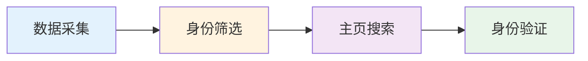
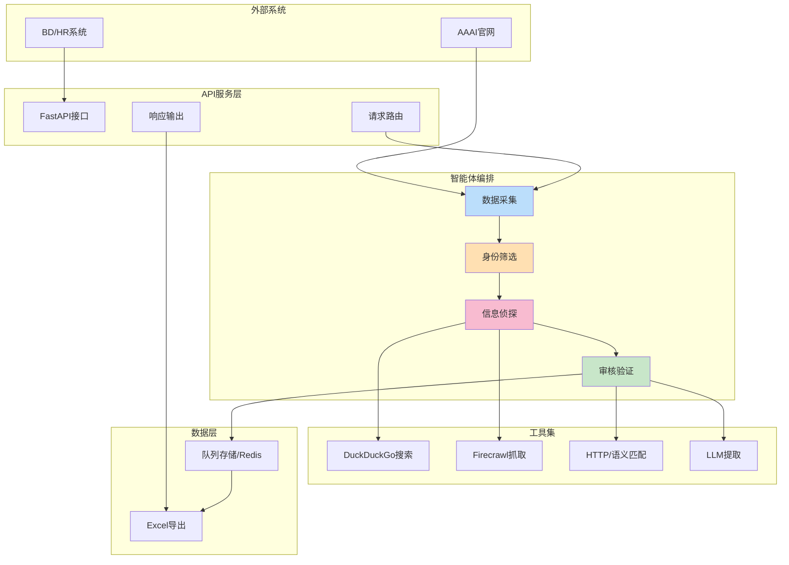
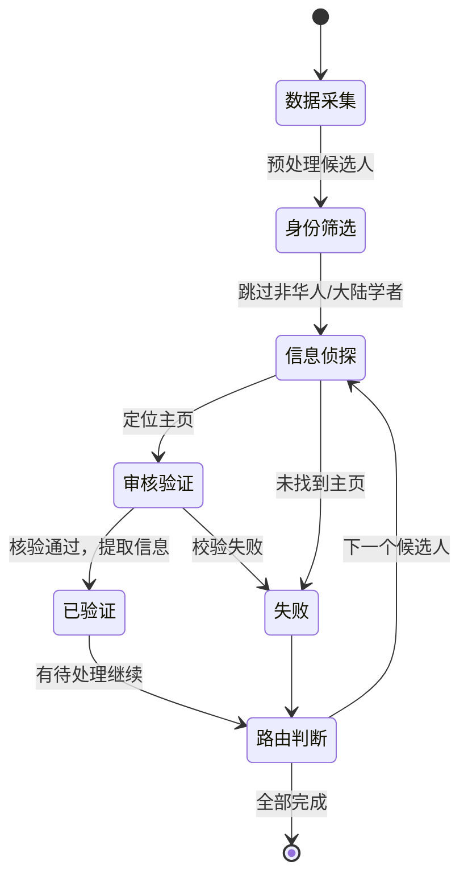
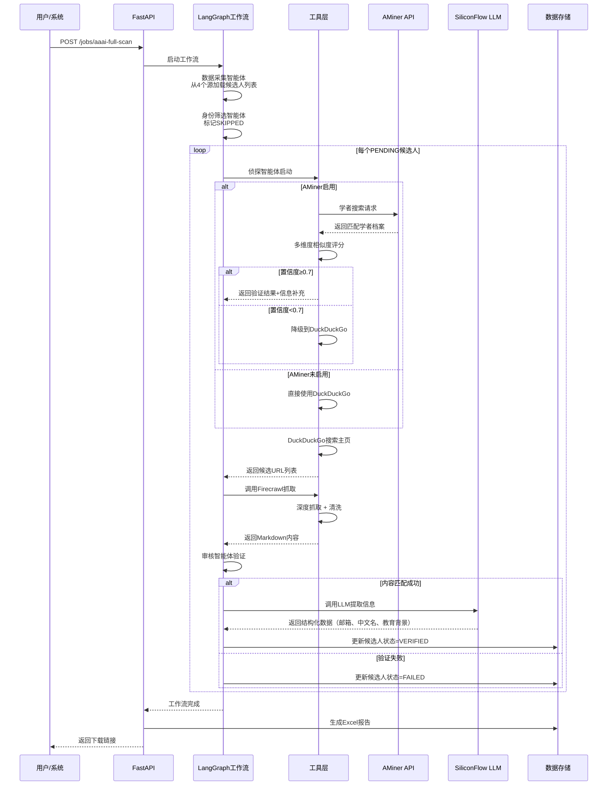
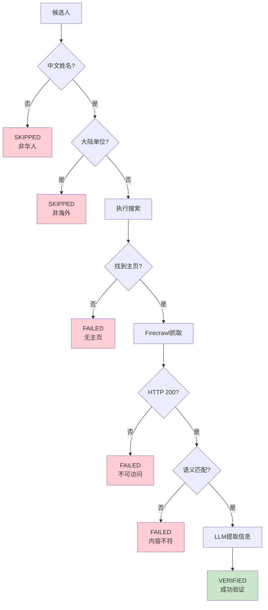

# AAAI-26 海外华人学者智能搜索
## 1. 项目背景与目标

AAAI-26（第26届国际人工智能大会）聚集了全球AI学者。为更高效服务于国内人才引进与国际学术交流，我们亟需精准识别在海外工作的华人学者：

- **人才引进**：全国高校、研究院所重点招聘对象
- **学术交流**：促进国际合作与交流
- **产业对接**：连接海外前沿技术与国内产业

### 业务挑战

| 传统痛点         | 负面影响                 |
|------------------|-------------------------|
| 人工筛选耗时长    | 600+人需数周             |
| 信息难核实        | 姓名相似易误判           |
| 验证成本高        | 主页访问/背景调查繁琐     |
| 数据格式不统一    | 难以结构化收集与分析     |

### 项目目标

打造一个**全自动、高精度**的海外华人学者发现系统：

- > **自动化率 ≥ 95%**（人工复核仅5%）
- > **识别准确率 ≥ 90%**（多轮验证机制）
- > **单人处理≤20秒，批量<4小时**
- > **邮箱/本科院校结构化提取≥70%**

---

## 2. 核心价值与创新点

### 技术创新亮点

- **多智能体协同架构：** 基于LangGraph建模，专业分工、状态驱动。
- **国产LLM智能解析：** 集成SiliconFlow（DeepSeek-V3）模型，支持多语种信息抽取与语义匹配。
- **端到端自动流转：** 数据采集/筛选/主页定位/身份验证全自动闭环。
- **可组合API服务：** 易于对接业务系统，支持快速集成。



### 业务成果

- **降本增效**：人力成本下降80%，处理周期4周→1天
- **数据资产化**：学者数据库可持续运营与分析
- **服务导向**：接口开放，支持BD/HR自动化操作
- **智能决策**：系统自动优先级排序与推荐

---

## 3. 技术架构设计

### 系统组成



### 技术栈精选

| 层次       | 技术               | 优势                                 |
|------------|--------------------|--------------------------------------|
| API        | FastAPI            | 高并发、类型安全、文档自动生成       |
| 智能体      | LangGraph/LangChain| 状态管控、易扩展、社区活跃           |
| LLM        | SiliconFlow (DeepSeek-V3) | 国内服务、低延迟、强中文理解      |
| 学者数据库  | AMiner Open API    | 学者身份验证、interests补充、多维度匹配 |
| 搜索       | DuckDuckGo         | 免费免密钥、抗封禁、隐私安全         |
| 抓取       | Firecrawl + httpx  | 支持JS渲染、结构化输出、自动降级     |
| 中文NLP    | xpinyin            | 名字拼音判定、姓氏支持               |
| 导出       | pandas/openpyxl    | Excel兼容性强、便于业务分析          |

---

## 4. 多智能体自动工作流

### 4.1 工作流概览



### 4.2 智能体节点简述

#### ① 数据采集（IngestionNode）
- **任务**：AAAI-26会议多源数据抓取&初步字段提取
- **数据源**：
  1. **Invited Speakers** - 特邀演讲者
  2. **Bridge Program** - Bridge Committee成员
  3. **Tutorials and Labs** - 讲师和指导员
  4. **Workshops** - Workshop组织者
- **输入**：多个AAAI专题页URL
- **输出**：标准候选人条目（姓名/单位/角色/来源），自动去重合并

#### ② 身份筛选（FilterNode）
- **任务**：自动识别海外华人学者
- **算法要点**：
  - 中文姓名检测（直接/拼音/常见姓氏）
  - 海外单位判定（大陆高校/研究院关键词屏蔽）
- **标准示例**：

  | 姓名           | 单位             | 结果             |
  |----------------|------------------|------------------|
  | Haoyang Li     | CMU              | ✅ PASS          |
  | Jie Tang       | Tsinghua          | ❌ SKIP（大陆）   |
  | John Smith     | MIT              | ❌ SKIP（非华人） |

#### ③ 信息侦探（DetectiveNode）
- **任务**：集成式身份验证与主页搜索
- **处理流程**：
  1. **AMiner验证**（可选，若启用）
     - 通过名字+机构搜索学者信息
     - 验证身份、补充中文名、研究兴趣等
     - 置信度阈值：≥0.7则标记已验证
  2. **DuckDuckGo搜索**（补充或备选）
     - 搜索学者主页
     - 排序权重：域名（.edu,+2分）、姓名特征(+4分)、关键词(+3分)、社媒(-5分)、PDF(-2分)
- **输出**：主页URL + 可选的AMiner补充信息（interests、教育背景等）
- **Firecrawl优势**：SEO抗干扰能力强、结构化输出便于AI理解

#### ④ 审核验证（AuditorNode）
- **三层校验闭环**：
  1. 连通性检查（HTTP 200）
  2. 语义匹配（姓名/单位关键词双命中）
  3. LLM抽取（邮箱、中文名、本科、单位复核）

---

## 5. 关键技术方案

### 5.0 AMiner学者身份验证与信息补充

**功能概述：**
AMiner是全球最大的学者档案库，集成AMiner Open API实现身份验证与信息补充：

**1. 身份验证**
- 通过名字+机构组合搜索学者档案
- 多维度相似度评分：
  - 名字完全匹配：0.4分
  - 机构包含匹配：0.35分  
  - 邮箱域名匹配：0.25分（可选）
- 置信度阈值：≥0.7认为验证成功

**2. 信息补充**
- **中文名**：获取学者的标准中文名（用于去重和报告）
- **Research Interests**：学者的研究方向标签（补充单位无法获得的信息）
- **教育背景**：本科、硕士、博士院校信息
- **职位历史**：历任机构与职位

**3. 配置方式**
```bash
# .env 文件配置
AMINER_ENABLED=True
AMINER_API_KEY=your_aminer_api_token_here
```

**4. 失败降级**
- 若AMiner API不可用或未启用，自动降级到DuckDuckGo搜索
- 系统可无缝处理，不影响主流程，保证稳定性

**5. API调用示例**
```bash
curl -X 'POST' 'https://datacenter.aminer.cn/gateway/open_platform/api/person/search' \
  -H 'Content-Type: application/json;charset=utf-8' \
  -H 'Authorization: your_token' \
  -d '{
    "name": "Haoyang Li",
    "offset": 0,
    "org": "Carnegie Mellon University",
    "size": 10
  }'
```

---

## 6. 多源数据采集体系

**支持的AAAI-26数据源**：

| 源名称 | URL | 目标元素 | 提取字段 |
|--------|-----|---------|---------|
| Invited Speakers | https://aaai.org/conference/aaai/aaai-26/invited-speakers/ | div.wp-block-columns | 名字、机构 |
| Bridge Program | https://aaai.org/conference/aaai/aaai-26/bridge-program/ | Bridge Committee部分 | 名字、机构 |
| Tutorials & Labs | https://aaai.org/conference/aaai/aaai-26/tutorials-and-labs/ | 讲师名单 | 名字、机构、讲座名称 |
| Workshops | https://aaai.org/conference/aaai/aaai-26/workshops/ | Organization Committee | 名字、机构、workshop名称 |

**去重机制**：基于(name.lower(), affiliation.lower())组合，自动去除重复候选人。

---

## 7. 关键技术方案

### 7.1 并发与稳定性优化

- 异步限流（建议值：DuckDuckGo并发不超3路）
- 超时/重试机制，全流程平均单人<25s
- Firecrawl失效时自动降级原生抓取

```python
from asyncio import Semaphore
class ConcurrencyController:
    def __init__(self, max_concurrent=3):
        self.semaphore = Semaphore(max_concurrent)
    async def execute(self, task):
        async with self.semaphore:
            return await task()
```

| 环节            | 优化后单次耗时（秒） |
|-----------------|-------------------|
| 搜索            | 2~5               |
| 抓取            | 3~8               |
| LLM提取         | 3~8               |
| 单人全流程      | 15~25             |
| 600人全流程     | 2~3小时           |

### 7.2 容错与多路降级

- Firecrawl不可用时降级httpx，无可用则标记失败，流程不中断。

---

## 7. 配置与部署指南

### 7.1 环境变量配置

创建 `.env` 文件，配置以下关键变量：

```bash
# SiliconFlow LLM配置（必需）
SILICONFLOW_API_KEY=sk_xxx_xxx
SILICONFLOW_BASE_URL=https://api.siliconflow.cn/v1
SILICONFLOW_MODEL=deepseek-ai/DeepSeek-V3

# 应用配置
APP_ENV=PROD  # DEV使用模拟数据，PROD使用真实爬取
API_VERSION=v1
CONCURRENT_SEARCHES=3  # DuckDuckGo并发数建议≤3

# AMiner API配置（可选但推荐）
AMINER_ENABLED=True
AMINER_API_KEY=aminer_token_here

# Firecrawl配置（可选，增强JS渲染能力）
FIRECRAWL_ENABLED=False
FIRECRAWL_API_KEY=fc_xxx_xxx

# AAAI-26数据源URL
AAAI_INVITED_SPEAKERS_URL=https://aaai.org/conference/aaai/aaai-26/invited-speakers/
BRIDGE_PROGRAM_URL=https://aaai.org/conference/aaai/aaai-26/bridge-program/
TUTORIALS_LABS_URL=https://aaai.org/conference/aaai/aaai-26/tutorials-and-labs/
WORKSHOPS_URL=https://aaai.org/conference/aaai/aaai-26/workshops/
```

### 7.2 依赖安装

```bash
cd Project_Code
pip install -r requirements.txt
```

### 7.3 启动应用

```bash
bash start.sh
# 或手动启动
python -m uvicorn app.main:app --host 0.0.0.0 --port 8000
```

### 7.4 快速测试

```bash
# 单人验证
curl -X POST "http://localhost:8000/api/v1/check-person" \
  -H "Content-Type: application/json" \
  -d '{"name": "Haoyang Li", "affiliation": "Carnegie Mellon University"}'

# 启动批量任务
curl -X POST "http://localhost:8000/api/v1/jobs/aaai-full-scan" \
  -H "Content-Type: application/json" \
  -d '{"limit": 10}'

# 查看任务状态
curl "http://localhost:8000/api/v1/jobs/{job_id}/status"

# 导出Excel结果
curl "http://localhost:8000/api/v1/jobs/{job_id}/export" -o result.xlsx
```

---

## 8. 项目结构说明

| 接口路径                             | 场景             |
|--------------------------------------|------------------|
| POST `/api/v1/check-person`          | 单人快速校验     |
| POST `/api/v1/jobs/aaai-full-scan`   | 会议批量启动     |
| GET `/api/v1/jobs/{id}/status`       | 任务进度查询     |
| GET `/api/v1/jobs/{id}/export`       | 结果Excel导出    |
| GET `/health`                        | 系统健康检查     |

**接口示例**：

- 单人验证请求
    ```json
    {
      "name": "Haoyang Li",
      "affiliation": "Carnegie Mellon University"
    }
    ```
- 成功响应
    ```json
    {
      "name": "Haoyang Li",
      "status": "VERIFIED",
      "homepage": "...",
      "email": "haoyangle@cs.cmu.edu",
      "name_cn": "李浩阳",
      "bachelor_univ": "Shanghai Jiao Tong University"
    }
    ```
- 失败响应
    ```json
    {
      "name": "John Smith",
      "status": "FAILED",
      "message": "未找到有效主页"
    }
    ```
- 导出的Excel含两表：
  - **已验证学者表**：英文姓名、中文姓名、单位、单位所属国家/地区、职位、研究方向、个人主页、邮箱
  - **统计汇总表**：任务ID、总候选人数、已验证数、失败数、跳过数、生成时间

---

## 10. 数据流与验证逻辑

**主流程（简化）：**



### 10.2 验证决策树


---

## 10. 风险及质量控制

### 核心风险及应对

| 风险项                   | 概率 | 影响 | 管控措施                |
|--------------------------|------|------|-------------------------|
| DuckDuckGo限流           | 中   | 中   | 并发限流、备用API       |
| Firecrawl服务失效        | 低   | 高   | 降级方案+监控           |
| LLM抽取失败              | 中   | 中   | 多模型/Prompt策略冗余   |
| 误识别率                | 低   | 高   | 加强姓名算法&抽查       |
| AAAI官网结构变动         | 低   | 中   | 解析器容错与热补丁      |
| 数据与隐私合规           | 低   | 高   | 仅公开数据、加密存储    |

### 质量保障三重门

1. **自动校验**（二元机制：主页连通性+内容语义双判）
2. **规则复查**（邮箱/URL有效性)
3. **人工抽检**（10%随机，低于85%召回全量复查）

---

**人工复核流程简述**：
- 系统定期随机抽检10%样本，由人工二次确认
- 准确率<85%时触发全量复核，并回馈优化算法与Prompt
