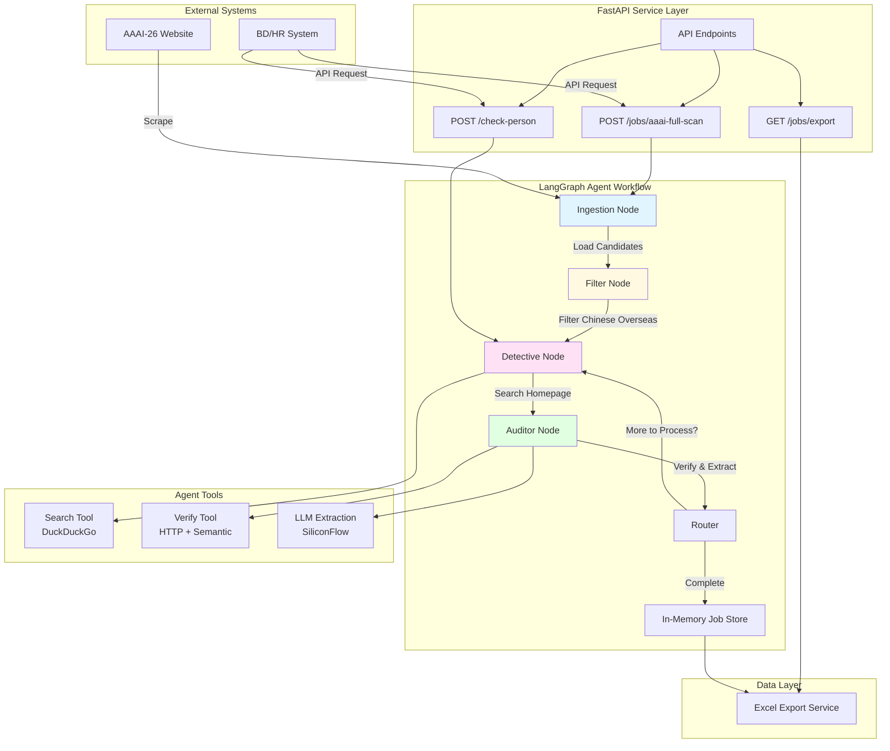
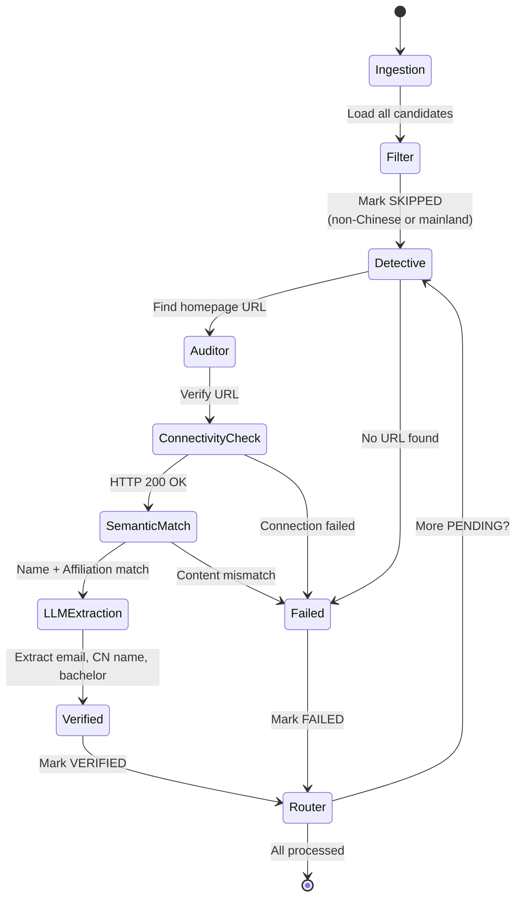
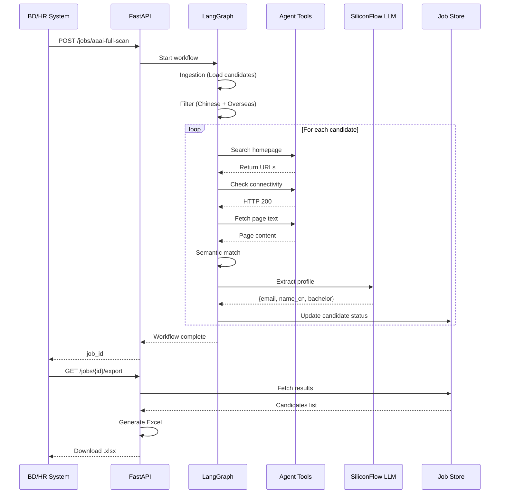
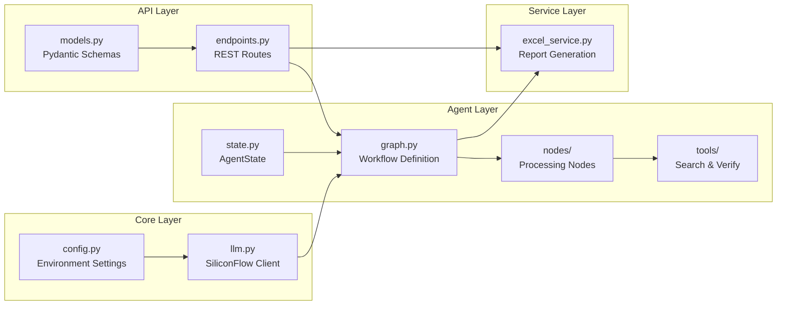

# AAAI-26 Talent Hunter - System Architecture

## 系统架构图 (System Architecture)



## Agent Workflow Diagram (代理工作流)



## Data Flow (数据流)



## Component Architecture (组件架构)



## Technology Stack (技术栈)

| Layer | Technology | Purpose |
|-------|------------|---------|
| **API Framework** | FastAPI | Async REST API |
| **Agent Orchestration** | LangGraph + LangChain | Multi-agent workflow |
| **LLM Provider** | SiliconFlow (DeepSeek-V3) | Profile extraction |
| **Search Engine** | DuckDuckGo Search | Homepage discovery |
| **Web Scraping** | httpx + BeautifulSoup4 | Content extraction |
| **Chinese NLP** | xpinyin | Name validation |
| **Data Export** | pandas + openpyxl | Excel generation |
| **Configuration** | Pydantic Settings | Environment management |

## Binary Verification Logic (二元验证逻辑)

```
Input: Candidate with potential homepage URL

Step 1: Connectivity Check
├─ Send HTTP GET request
├─ Follow redirects (max 5)
└─ Result: HTTP 200? 
    ├─ Yes → Continue to Step 2
    └─ No → Mark as FAILED

Step 2: Content Extraction
├─ Parse HTML with BeautifulSoup
├─ Remove <script>, <style> tags
├─ Extract plain text
└─ Limit to 10,000 characters

Step 3: Semantic Matching
├─ Check: Name in page text? (Required)
├─ Check: Affiliation in page text? (Preferred)
└─ Check: Affiliation keywords? (Alternative)
    ├─ All checks pass → Mark as VERIFIED, Continue to Step 4
    └─ Any check fails → Mark as FAILED

Step 4: LLM Extraction (Only if VERIFIED)
├─ Send page text + context to SiliconFlow
├─ Prompt: Extract email, Chinese name, bachelor university
├─ Parse JSON response
└─ Update candidate profile
```

## Deployment Architecture (部署架构)

### Development (DEV Mode)
```
┌─────────────────────────┐
│   Developer Machine     │
│                         │
│  ┌──────────────────┐  │
│  │  FastAPI Server  │  │
│  │  localhost:8000  │  │
│  └────────┬─────────┘  │
│           │             │
│  ┌────────▼─────────┐  │
│  │  Mock Data (5)   │  │
│  └──────────────────┘  │
└─────────────────────────┘
```

### Production (PROD Mode)
```
┌──────────────────────────────────────┐
│         Cloud Server (AWS/Azure)     │
│                                      │
│  ┌────────────────────────────────┐ │
│  │      Nginx (Reverse Proxy)     │ │
│  └────────────┬───────────────────┘ │
│               │                      │
│  ┌────────────▼───────────────────┐ │
│  │    Uvicorn (FastAPI Workers)   │ │
│  │    Multi-process mode          │ │
│  └────────────┬───────────────────┘ │
│               │                      │
│  ┌────────────▼───────────────────┐ │
│  │   Redis/PostgreSQL (Jobs)      │ │
│  └────────────────────────────────┘ │
└──────────────────────────────────────┘
         │                    │
         ▼                    ▼
   ┌──────────┐         ┌──────────┐
   │ AAAI.org │         │SiliconFlow│
   └──────────┘         └──────────┘
```

## API Design Principles (API 设计原则)

1. **Service-Oriented Architecture (SOA)**
   - RESTful endpoints for external integration
   - Clear separation of concerns
   - Stateless request handling

2. **Async/Await for Concurrency**
   - Non-blocking I/O for HTTP requests
   - Concurrent search operations (with rate limiting)
   - Background job processing

3. **Binary Verification**
   - Strict verification: VERIFIED or FAILED (no "maybe")
   - Multiple validation layers (connectivity → semantic → LLM)
   - Clear failure reasons for debugging

4. **Extensibility**
   - Easy to add new agent nodes
   - Pluggable search providers (DuckDuckGo → SerpAPI)
   - Configurable LLM providers

## Security Considerations (安全考虑)

- **API Key Management**: Environment variables only, never in code
- **Rate Limiting**: Control concurrent searches to avoid IP bans
- **Input Validation**: Pydantic models for all API inputs
- **Error Handling**: Graceful degradation, no sensitive info in errors
- **CORS**: Configurable allowed origins for production

## Performance Optimization (性能优化)

- **Concurrent Searches**: Process multiple candidates in parallel (configurable)
- **Early Exit**: Stop processing if verification fails early
- **Text Truncation**: Limit page text to 10K chars to reduce LLM costs
- **Caching**: (Future) Cache search results for common affiliations

## Future Enhancements (未来增强)

1. **Database Integration**: Replace in-memory store with PostgreSQL/Redis
2. **Advanced Search**: Add SerpAPI for better results
3. **Firecrawl Integration**: Deep content extraction
4. **Webhook Notifications**: Alert when jobs complete
5. **Rate Limiting**: Add per-IP rate limits
6. **Monitoring**: Add Prometheus metrics
7. **Admin Dashboard**: Web UI for job management